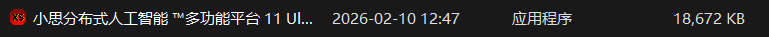
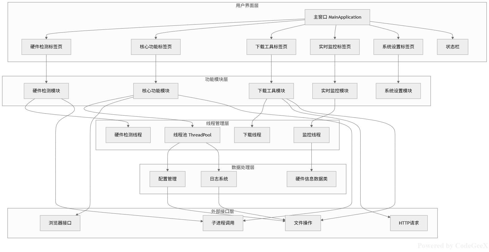
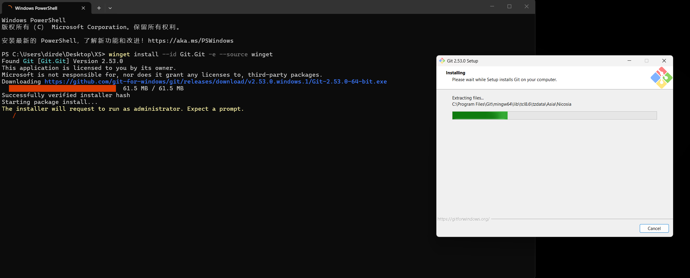

# 小思分布式人工智能平台


<div align="center">

| [Python 3.14](https://www.python.org/downloads/release/python-3143/) 
| [jetbrains\PyCharm联合开发](https://www.jetbrains.com/zh-cn/pycharm/) 
| [国内IDE联合开发](https://www.trae.cn/) 
| [国内人工智能大模型IDE\CodeBuddy IDE](https://www.codebuddy.ai/home) |

一款集硬件检测、系统监控、多线程下载与常用工具箱于一体的 Windows 桌面全能平台。

[功能原理](https://gitee.com/dirde12078904/Xiaosi-Artificial-Intelligence-Developer-Conference/blob/main/XIAO%20SI%20AI%E6%A8%A1%E5%9E%8B/Xiao%20Si%20AI%20Kernel.py) · [Gen 4 开源架构](https://gitee.com/dirde12078904/xiao-si/blob/main/OpenGEN.py) · [下载使用](https://gitee.com/dirde12078904/Xiaosi-Distributed-Artificial-Intelligence-Platform/releases) · [发行版本查看](https://gitee.com/dirde12078904/Xiaosi-Distributed-Artificial-Intelligence-Platform/releases)

</div>

✨ 项目简介

本项目（代号：多功能网络传输检测旗舰平台）是一个基于 Python `tkinter` 开发的现代化桌面应用程序。它旨在通过统一的图形化界面，集成日常开发与运维所需的各类工具，解决工具分散、切换繁琐的痛点。项目采用多线程并发架构，确保在进行深度硬件检测或大文件下载时，UI 界面依然保持流畅响应。

🚀 核心特性

-   🛠️ 一站式工具箱：内置 NxShell、Termius、FastCopy、图吧工具箱等 10+ 款常用开发与运维工具，支持一键启动。
-   ⚡ 极速多线程下载：内置高性能文件下载器，支持分块并发下载与断点续传，实时显示下载速度与进度。
-   🔍 深度硬件检测：
    -   1.GPU 深度剖析：通过 NVML/PyCUDA 接口，精准获取显卡架构、显存占用、温度及计算能力。
    -   2.CPU 全方位监控：详细展示 CPU 型号、核心数、频率及缓存信息。
-   📊 实时系统监控：可视化仪表盘，实时追踪 CPU 与内存（RAM）的利用率波动。
-   🧵 并发架构设计：内置自定义线程池（`ThreadPool`），将耗时任务（如系统清理、性能测试）后台化，绝不阻塞主线程。

📸 功能预览

1. 硬件检测与监控
提供可视化的硬件状态面板，支持 NVIDIA 显卡深度信息读取。

2. 核心功能集成
将分散的 `.exe` 工具集成在网格布局中，分类清晰，点击即用。

3. 多线程下载器
支持 URL 解析、多线程分块下载、进度条实时反馈。

🛠️ 技术栈

-   **GUI 框架**：Python `tkinter` + `ttk`
-   **系统交互**：`psutil`, `subprocess`, `ctypes`
-   **硬件检测**：`nvidia-smi` (NVML), `pycuda` (fallback), `cpuinfo`
-   **网络请求**：`requests`
-   **并发处理**：`threading`, `queue`

(注释)依赖安装
本软件即为及下及用，无需额外配置

运行程序
下载及启动
Windows 10 \ 11 版本

软件本体



[软件下载](https://gitee.com/dirde12078904/Xiaosi-Distributed-Artificial-Intelligence-Platform/releases)

📝 使用说明

1. 启动工具：点击"核心功能"标签页，选择对应的工具按钮即可启动（请确保 `config` 目录下对应的工具文件存在）。
2. 硬件检测：在"硬件检测"页选择 GPU 或 CPU，点击"开始深度检测"查看详细参数。
3. 文件下载：在"下载工具"页粘贴链接，选择保存路径，点击"开始下载"即可体验多线程加速。


🤝 贡献

微信：szx20050719
邮箱：dirde12078904@163.com

[哔哩哔哩官方](https://www.bilibili.com/video/BV1zV27B8EMH?t=23.8)

---
# 网络管理(WLAN)

📦 安装指南（网络模块GUI——> Network GUI）

如果您还没有安装 winget 工具，请先安装，然后在命令提示符或 Powershell 中输入此命令。

```bash
winget install --id Git.Git -e --source winget
```



克隆本项目

```bash
git clone https://gitee.com/dirde12078904/Xiaosi-Distributed-Artificial-Intelligence-Platform.git
```

安装本项目Python依赖

```bash
cd Xiaosi-Distributed-Artificial-Intelligence-Platform
pip install -r requirements.txt
```

运行

```bash
python 小思分布式人工智能网络模块.py
```

---
# 视觉管理 (Visual)

📦 安装指南（视觉模块GUI——>   Visual GUI）

如果您还没有安装 winget 工具，请先安装，然后在命令提示符或 Powershell 中输入此命令。

```bash
winget install --id Git.Git -e --source winget
```
克隆本项目

```bash
git clone https://gitee.com/dirde12078904/Xiaosi-Distributed-Artificial-Intelligence-Platform.git
```

安装本项目Python依赖

```bash
cd Xiaosi-Distributed-Artificial-Intelligence-Platform
pip install -r requirements 视觉模块.txt
```
运行
```bash
python 小思分布式视觉管理模块.py
```
---
运行界面


---
# 大模型管理(OpenClaw 联合 LM Studio 开发)
---

# 快速开始(OpenClaw)

1.安装 OpenClaw

Linux
```bash
npm install -g openclaw@latest
```

新手引导并安装服务

如果你已经有 Node：
```bash
openclaw onboard --install-daemon
```
配对 WhatsApp 并启动 Gateway 网关
```bash
openclaw channels login
openclaw gateway --port 18789
```
# 远程访问：Web 界面
仪表板
Gateway 网关启动后，打开浏览器控制界面。

本地默认地址：http://127.0.0.1:18789/

---
Windows(PowerShell)

工作原理（架构）
```bash
WhatsApp / Telegram / Slack / Discord / Google Chat / Signal / iMessage / BlueBubbles / IRC / Microsoft Teams / Matrix / Feishu / LINE / Mattermost / Nextcloud Talk / Nostr / Synology Chat / Tlon / Twitch / Zalo / Zalo Personal / WebChat
               │
               ▼
┌───────────────────────────────┐
│            Gateway            │
│       (control plane)         │
│     ws://127.0.0.1:18789      │
└──────────────┬────────────────┘
               │
               ├─ Pi agent (RPC)
               ├─ CLI (openclaw …)
               ├─ WebChat UI
               ├─ macOS app
               └─ iOS / Android nodes
```
Windows（PowerShell）：
`iwr -useb https://openclaw.ai/install.ps1 | iex`

下一步（如果你跳过了新手引导）：`openclaw onboard --install-daemon`

# 配置（可选）

配置文件位于 `~/.openclaw/openclaw.json`

如果你不做任何修改，OpenClaw 将使用内置的 Pi 二进制文件以 RPC 模式运行，并按发送者创建独立会话。
如果你想要限制访问，可以从 和（针对群组的）提及规则开始配置。

channels.whatsapp.allowFrom

克隆到本地

`git clone https://gitcode.com/GitHub_Trending/cl/openclaw.git`

[项目官方](https://gitcode.com/GitHub_Trending/cl/openclaw?source_module=search_project)
# 解决方案
系统上禁止运行脚本

原因

首次在计算机上启动 Windows PowerShell 时，现用执行策略很可能是 Restricted（默认设置）。Restricted 策略不允许任何脚本运行。需要收到开启运行脚本

---
管理员运行

`Set-ExecutionPolicy RemoteSigned`
键入Y或者A,同意

执行get-executionpolicy查看是否更改成功，为RemoteSigned表示成功

---

# 快速开始(LM Studio)
运行AI模型，本地和私密。
使用本地大型语言模型

如 gpt-oss、Qwen3、Gemma3、DeepSeek
还有更多，在你自己的硬件上本地运行。

---
# 下载
Mac / Linux

`curl -fsSL https://lmstudio.ai/install.sh | bash`

Windows

`irm https://lmstudio.ai/install.ps1 | iex`

---
# 开发者资源
JS SDK 

`npm install @lmstudio/sdk`

Python SDK

`pip install lmstudio`

---
Made with ❤️ by Xiao Si Ai

Made in Xiaosi Distributed Artificial Intelligence