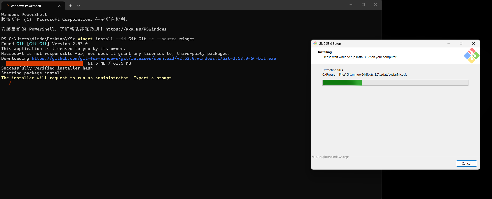
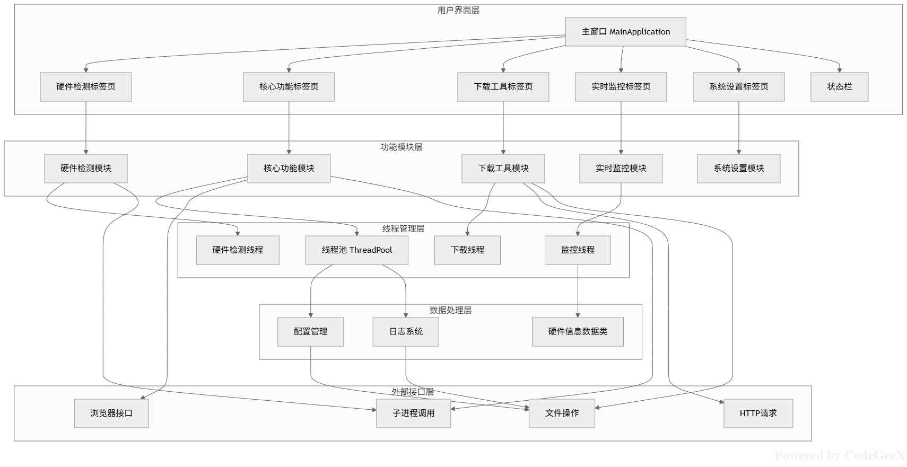

<span style="font-size:48px;"></span>

<div align="center">

**<span style="font-size:36px;">小思分布式人工智能平台</span>**

*把散落在桌面各处的开发与运维工具，收进一个不卡顿的桌面平台。*

[](https://www.python.org/downloads/)
[](#)
[](./LICENSE)
[](https://gitcode.com/dirde12078fb5/Xiaosi-Distributed-Artificial-Intelligence-Platform/releases)
[](https://gitcode.com/dirde12078fb5/Xiaosi-Distributed-Artificial-Intelligence-Platform)

[](https://gitcode.com/dirde12078fb5/Xiaosi-Distributed-Artificial-Intelligence-Platform)
[](https://gitcode.com/dirde12078fb5/Xiaosi-Distributed-Artificial-Intelligence-Platform/releases)

</div>

## Stargazers over time


---

## ✨ 30 秒看懂这是什么

**一句话**：一个用 Python `tkinter` 写的桌面平台，把日常开发/运维要用的工具、下载器、硬件检测、网络/视觉/服务/大模型管理，全收进一个窗口里，多线程不卡顿。

| 你是不是这样 | 它给你什么 |
|---|---|
| 工具散在桌面十几个图标，切来切去烦 | 一站式工具箱，分类网格，点开即用 |
| 想看显卡/CPU 深度信息，要装一堆软件 | NVML/PyCUDA 直接读 GPU 架构、显存、温度 |
| 大文件下载慢、又不支持断点 | 内置多线程分块下载 + 断点续传 |
| 想跑本地大模型、管 PXE、管 NAS，各装一套 | 网络/视觉/服务/大模型/PXE/NAS 模块化，可单跑可合用 |

**给谁用**：开发、运维、技术爱好者、想在本地搭一套"小而全"工具链的人。
**凭啥用**：① 即下即用（exe）② 跨平台 ③ 模块化、每个模块都能单独跑 ④ 多线程、检测时不卡 UI。

> 💡 项目运行文件较大且会持续增大，建议用 7-Zip 解压：
> 英文 https://7-zip.org/download.html ｜ 中文 https://sparanoid.com/lab/7z/

---

## 📦 下载与快速上手

### 方式 A：普通用户（推荐，即下即用）

下载打包好的发行版，双击运行，无需配置环境：

[](https://gitcode.com/dirde12078fb5/Xiaosi-Distributed-Artificial-Intelligence-Platform/releases)

- 发行版：https://gitcode.com/dirde12078fb5/Xiaosi-Distributed-Artificial-Intelligence-Platform/releases
- 夸克网盘群（点链接加入）：https://pan.quark.cn/g/8968af6533
- 哔哩哔哩演示：https://www.bilibili.com/video/BV1zV27B8EMH


### 方式 B：开发者 / 从源码跑

```bash
git clone https://gitcode.com/dirde12078fb5/Xiaosi-Distributed-Artificial-Intelligence-Platform.git
cd Xiaosi-Distributed-Artificial-Intelligence-Platform
```

然后看下面「一键搭建」。

---

## 🚀 一键搭建（源码方式）

不想手动敲 `pip install` 和记入口文件？用 `快速搭建/` 里的脚本，双击即可。

### Windows

```bash
# 1. 安装依赖（会自动装三个 requirements）
双击  快速搭建\一键安装.bat

# 2. 启动选单（选编号运行对应模块）
双击  快速搭建\一键启动.bat
```

### Linux / macOS

```bash
bash 快速搭建/install.sh   # 安装依赖
bash 快速搭建/start.sh      # 启动选单
```

### 手动方式（备用）

```bash
pip install -r "requirements.txt"             # 基础 + 网络模块
pip install -r "requirements 视觉模块.txt"     # 视觉模块
pip install -r "requirements 服务管理.txt"     # 服务管理

python 小思分布式人工智能网络模块.py          # 网络模块
python 小思分布式视觉管理模块.py              # 视觉模块
python 内网通服.py && python 外网通服.py       # 服务管理
```

---

## 🧩 模块一览

| 模块 | 用途 | 入口 | 依赖 |
|---|---|---|---|
| 主桌面平台（旗舰） | 工具箱+多线程下载+硬件检测+系统监控 | 发行版 exe | 即下即用 |
| 网络管理 (WLAN) | WiFi 扫描、网络工具 GUI | `小思分布式人工智能网络模块.py` | `requirements.txt` |
| 视觉管理 | 摄像头/图像处理 GUI | `小思分布式视觉管理模块.py` | `requirements 视觉模块.txt` |
| 服务管理 | 内网/外网通信服务 | `内网通服.py` / `外网通服.py` | `requirements 服务管理.txt` |
| 大模型管理 | OpenClaw + LM Studio 本地大模型 | 见下文 | Node.js / LM Studio |
| 小思超级 PXE | 跨平台网络安装系统（DHCP/TFTP/HTTP） | `小思超级服务/小思超级PXE/gui.py` | Python 标准库，无额外依赖 |
| 小思超级多版本 NAS | 多版本 NAS 服务（Go 实现） | `小思超级服务/小思超级多版本NAS 1/` | Go 1.24+ |
| 人工智能应用及漏洞管理 | AI 应用与漏洞管理 | `小思人工智能应用及漏洞管理/` | 见子目录 README |

---

## 🛠️ 各模块说明

### 网络管理 (WLAN)



```bash
python 小思分布式人工智能网络模块.py
```

### 视觉管理

```bash
python 小思分布式视觉管理模块.py
```

运行界面：


### 服务管理

```bash
python 内网通服.py && python 外网通服.py
```

### 大模型管理（OpenClaw 联合 LM Studio）

在本地私密运行 gpt-oss、Qwen3、Gemma3、DeepSeek 等模型。

**LM Studio 安装**

```bash
# Mac / Linux
curl -fsSL https://lmstudio.ai/install.sh | bash
# Windows (PowerShell)
irm https://lmstudio.ai/install.ps1 | iex
```

**OpenClaw 安装**

```bash
npm install -g openclaw@latest
openclaw onboard --install-daemon
openclaw channels login
openclaw gateway --port 18789
```

本地默认控制台：http://127.0.0.1:18789/

架构：

```
WhatsApp / Telegram / Slack / Discord / Feishu / LINE / Teams / Matrix ...
               │
               ▼
        ┌─────────────┐
        │   Gateway    │  ws://127.0.0.1:18789
        └──────┬───────┘
               ├─ Pi agent (RPC)
               ├─ CLI (openclaw …)
               ├─ WebChat UI
               ├─ macOS app
               └─ iOS / Android nodes
```

> 若 PowerShell 提示"禁止运行脚本"，以管理员执行：
> `Set-ExecutionPolicy RemoteSigned`（输入 Y 或 A）。

### 小思超级 PXE

纯 Python 跨平台 PXE 网络安装系统（DHCP/TFTP/HTTP），含 GUI，使用标准库，无额外依赖。

```bash
cd 小思超级服务/小思超级PXE
python gui.py          # GUI（推荐）
# 或
python cli.py server   # 命令行（需管理员/root）
```

详见 [小思超级服务/小思超级PXE/README.md](./小思超级服务/小思超级PXE/README.md)。

### 小思超级多版本 NAS（Go）

```bash
cd 小思超级服务/小思超级多版本NAS 1
go run cmd/server/main.go
```

详见 [小思超级服务/小思超级多版本NAS 1/README.md](./小思超级服务/小思超级多版本NAS 1/README.md)。

### 人工智能应用及漏洞管理

详见 [小思人工智能应用及漏洞管理/README.md](./小思人工智能应用及漏洞管理/README.md)。

---

## 📊 支持平台与版本

| 版本名称 | 支持平台 | 核心优点 |
|---|---|---|
| 基础版 | Windows 10/11(x86/x64)、Windows Server 2019/2022 | 界面简洁、启动快、占用低、依赖少 |
| Pro Max X3D 版 | 上述 + Linux(Ubuntu/CentOS)、macOS | 线程池并发、多线程下载、监控日志缓存、UI 美化 |
| Ultra X3D | 上述 + iOS | 功能最全、硬件检测深度、断点续传、iOS 远程访问 |
| NEXT | Windows 11 / Windows 11 专业版 | 安装包一体性 |

**版本系列**

| 数字系列 | ULTRA 系列 | NEXT 系列（非正式版本） |
|---|---|---|
| 小思分布式人工智能平台 11 系列 | 小思分布式人工智能平台 11 ULTRA X3D | 小思分布式人工智能平台 NEXT 1 2025 |

---

## 📋 版本历史与功能对照

> 各版本详细发布记录与下载见 Release 页面：
> https://gitcode.com/dirde12078fb5/Xiaosi-Distributed-Artificial-Intelligence-Platform/releases

### 版本线一览

| 系列 | 版本 | 定位 | 支持平台 |
|---|---|---|---|
| 数字系列 | 11 系列 | 标准版，稳定够用 | Windows 10/11、Windows Server 2019/2022 |
| ULTRA 系列 | 11 ULTRA X3D | 旗舰版，功能最全 | 上述 + Linux、macOS、iOS |
| NEXT 系列 | NEXT 1 2025 | 非正式版本，安装包一体性 | Windows 11 / Windows 11 专业版 |

### 各版本功能对照

| 功能 | 基础版 | Pro Max X3D | Ultra X3D | NEXT |
|---|:---:|:---:|:---:|:---:|
| 一站式工具箱 | ✅ | ✅ | ✅ | ✅ |
| 多线程下载 | 基础 | 线程池并发 | 断点续传 | ✅ |
| 硬件检测（CPU/GPU） | 基础 | 深度 | 深度+ | ✅ |
| 系统监控仪表盘 | ✅ | ✅ | ✅ | ✅ |
| 监控日志缓存 | — | ✅ | ✅ | ✅ |
| UI 美化 | 基础 | ✅ | ✅ | ✅ |
| 跨平台（Linux/macOS） | — | ✅ | ✅ | — |
| iOS 远程访问 | — | — | ✅ | — |
| 一体化安装包 | — | — | — | ✅ |

> 选型建议：日常 Windows 使用选 **基础版**；要跨平台 + 多线程选 **Pro Max X3D**；要 iOS 远程 + 全功能选 **Ultra X3D**；追求一体化安装包选 **NEXT**。

---

## 📸 软件展示



<span style="font-size:32px;">小思超级电脑管家</span>（2026 年 10 月发布）


<span style="font-size:32px;">第五代 GEN 架构</span>（2027 年元旦）


---

## 📥 软件下载

[](https://gitcode.com/dirde12078fb5/Xiaosi-Distributed-Artificial-Intelligence-Platform.git)

```bash
git clone https://gitcode.com/dirde12078fb5/Xiaosi-Distributed-Artificial-Intelligence-Platform.git
```

---

## 🤝 贡献与联系

- 微信：`szx20050719`
- 邮箱：dirde12078904@163.com
- 哔哩哔哩：https://www.bilibili.com/video/BV1zV27B8EMH

欢迎加入项目，让更多开源软件接入进来：

- 参与者邀请（过期 2027-02-01）：https://gitcode.com/invite/link/cdd051b1807242f69dfc
- 开发者邀请（过期 2027-06-30）：https://gitcode.com/invite/link/d53b72e65ce9453ab9d3

---

## ⚖️ 合规与免责说明

- 本平台**核心功能**（桌面工具箱、下载器、硬件检测、网络/视觉/服务/大模型/PXE/NAS 等模块）均为本项目自有代码，遵循 MIT 许可证。
- 仓库内 `SecureCRT汉化版/`、`Windows 激活/`、`Windows 更新延迟/` 等目录下的**第三方工具版权归原作者所有**，仅作学习与便利性集成，**不参与发行版商业分发**；商业使用请购买正版。若你是权利方且要求移除，请通过上方联系方式告知，我们会即时处理。
- 使用任何激活/破解类工具的风险由使用者自担，请遵守当地法律法规。

---

<div align="center">

Made with ❤️ by Xiao Si Ai ｜ Made in Xiaosi Distributed Artificial Intelligence

</div>
