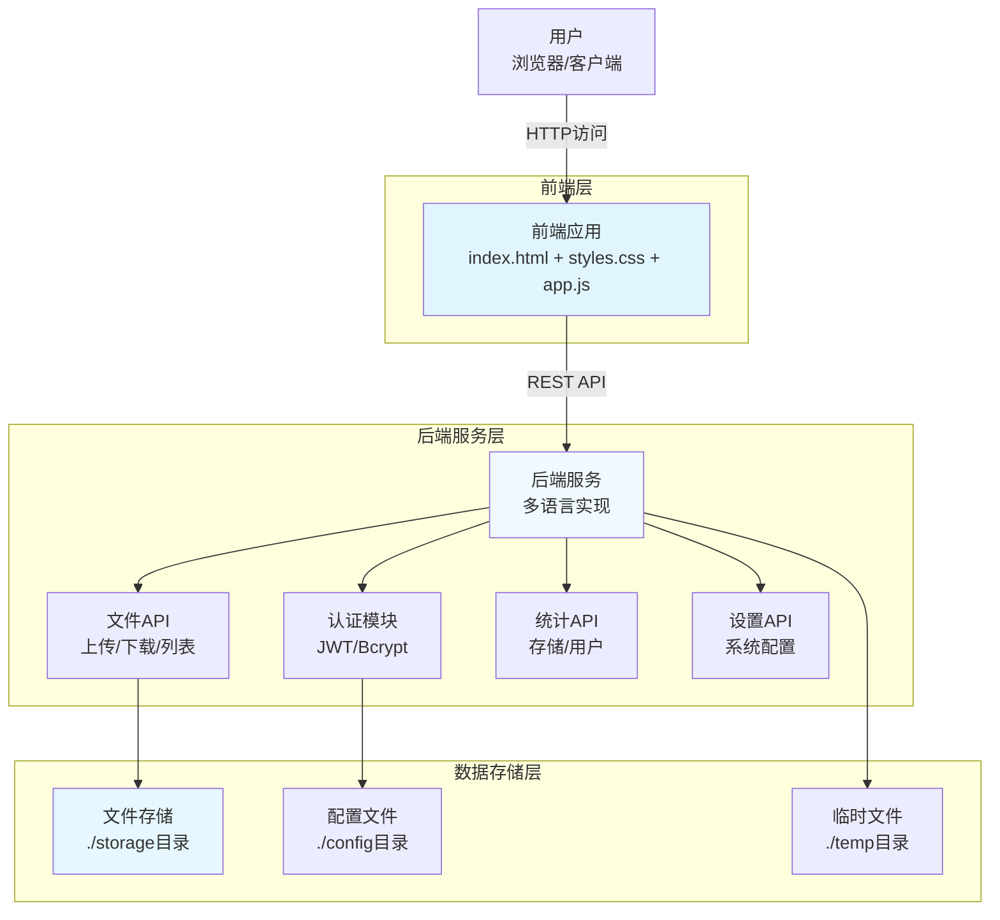
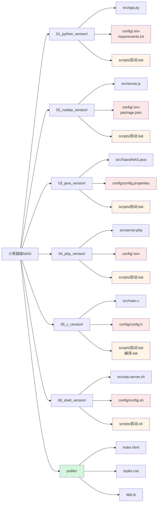
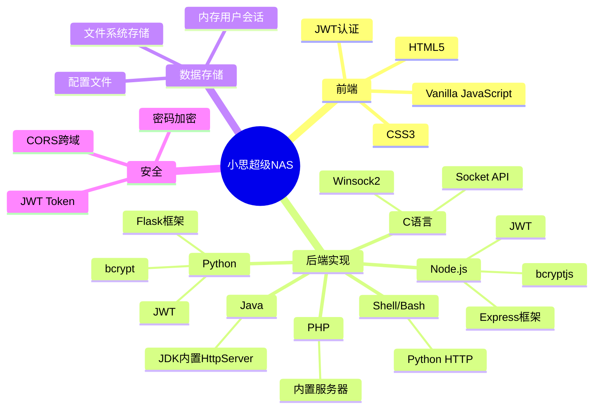
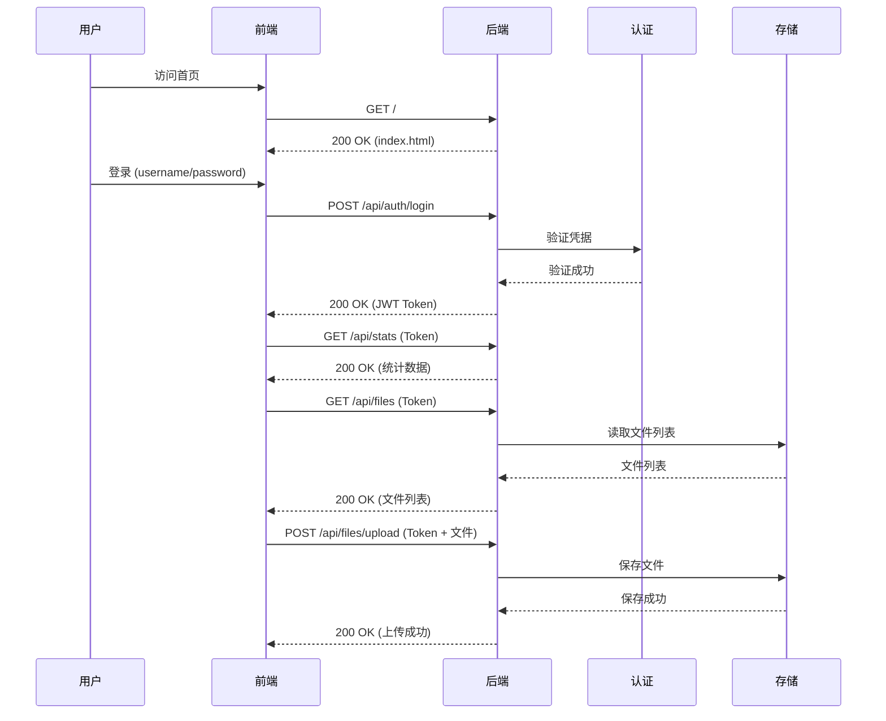

# 小思超级NAS

智能存储管理平台 - 多语言版本

## 📋 项目简介

小思超级NAS是一个智能网络存储管理平台，支持多种编程语言实现，让您可以根据自己的技术栈选择最适合的版本。

## 🏗️ 系统架构

### 整体架构图



### 目录架构图



### 技术栈架构图



### API架构图



## 🚀 快速开始

### 选择您的语言版本

本项目提供6种语言实现：

1. **Python版本** - 易于部署，无需编译
   - 路径: [01_python_version](01_python_version/)
   - 启动: 双击 `scripts\启动.bat`

2. **Node.js版本** - 高性能JavaScript运行时
   - 路径: [02_nodejs_version](02_nodejs_version/)
   - 启动: 双击 `scripts\启动.bat`

3. **Java版本** - 企业级可靠性
   - 路径: [03_java_version](03_java_version/)
   - 启动: 双击 `scripts\启动.bat`

4. **PHP版本** - 广泛兼容，易于部署
   - 路径: [04_php_version](04_php_version/)
   - 启动: 双击 `scripts\启动.bat`

5. **C语言版本** - 最高性能，需要编译
   - 路径: [05_c_version](05_c_version/)
   - 编译: 双击 `scripts\编译.bat`
   - 启动: 双击 `scripts\启动.bat`

6. **Shell版本** - Linux/Unix专用
   - 路径: [06_shell_version](06_shell_version/)
   - 启动: 运行 `scripts/启动.sh`

## 📁 项目结构

```
小思超级NAS/
├── 01_python_version/          # Python版本
│   ├── src/                    # 源代码
│   ├── config/                 # 配置文件
│   └── scripts/                # 启动脚本
├── 02_nodejs_version/          # Node.js版本
│   ├── src/                    # 源代码
│   ├── config/                 # 配置文件
│   └── scripts/                # 启动脚本
├── 03_java_version/            # Java版本
│   ├── src/                    # 源代码
│   ├── config/                 # 配置文件
│   └── scripts/                # 启动脚本
├── 04_php_version/            # PHP版本
│   ├── src/                    # 源代码
│   ├── config/                 # 配置文件
│   └── scripts/                # 启动脚本
├── 05_c_version/               # C语言版本
│   ├── src/                    # 源代码
│   ├── config/                 # 配置文件
│   └── scripts/                # 编译和启动脚本
├── 06_shell_version/          # Shell版本
│   ├── src/                    # 源代码
│   ├── config/                 # 配置文件
│   └── scripts/                # 启动脚本
└── public/                     # 公共前端文件
    ├── index.html
    ├── styles.css
    └── app.js
```

## 🌟 主要功能

- **文件管理**: 上传、下载、创建文件夹
- **用户管理**: 用户注册、权限控制
- **存储统计**: 实时存储使用情况
- **系统设置**: 灵活的配置选项
- **跨平台**: 支持Windows、Linux、macOS

## 🔐 默认登录

- 用户名: `admin`
- 密码: `admin123`

## 📡 访问地址

启动后访问：
- 本地访问: `http://localhost:8080`
- 局域网访问: `http://<您的IP地址>:8080`

## 🛠️ 技术栈

### Python版本
- Flask
- Flask-CORS
- JWT认证
- bcrypt密码加密

### Node.js版本
- Express
- CORS
- JSON Web Token
- bcryptjs

### Java版本
- JDK内置HttpServer
- 无需额外依赖

### PHP版本
- PHP内置服务器
- JSON处理

### C语言版本
- POSIX Socket API
- Windows Winsock2
- 多线程支持

### Shell版本
- Python HTTP服务器
- Bash脚本

## 📝 详细文档

- [多语言版本指南](多语言版本指南.md) - 各版本详细说明和对比

## 🤝 贡献

欢迎提交Issue和Pull Request！

## 📄 许可证

MIT License

## 👨‍💻 作者

小思AI团队

## 🙏 致谢

感谢所有开源项目的贡献者！
