# 小思超级NAS

智能存储管理平台 - 多语言版本

## 📋 项目简介

小思超级NAS是一个智能网络存储管理平台，支持多种编程语言实现，让您可以根据自己的技术栈选择最适合的版本。

## 🏗️ 系统架构

### 整体架构图

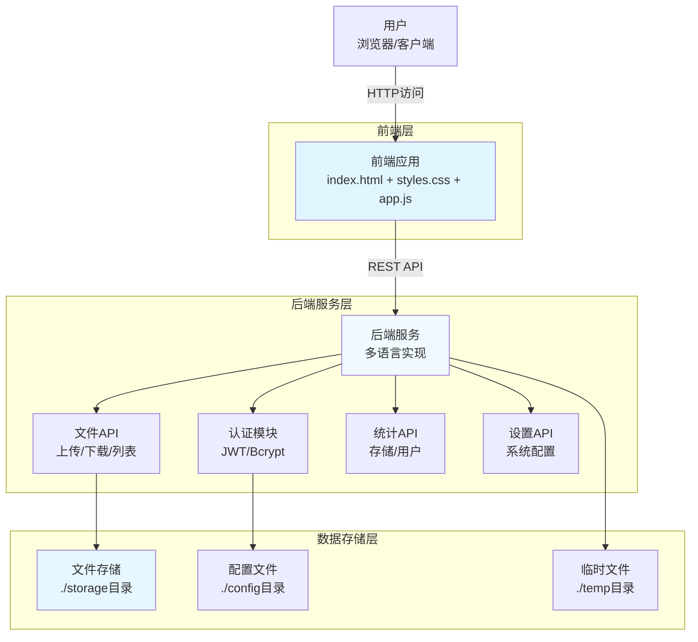

### 目录架构图

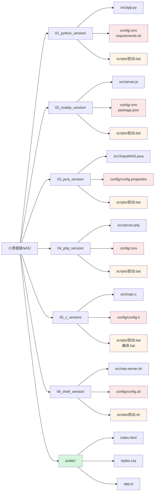

### 技术栈架构图

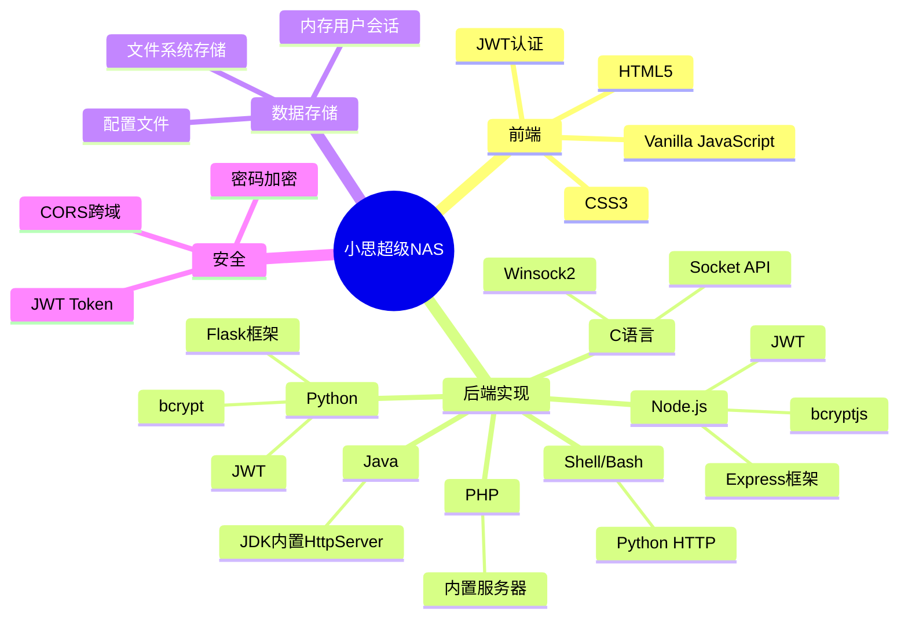

    style FileManager fill:#ffb3d9
    style UserManager fill:#ffe6b3
    style StatsCollector fill:#b3ffff
    style SettingsMgr fill:#d9ffb3
```

### 组件架构图（后端详细结构）

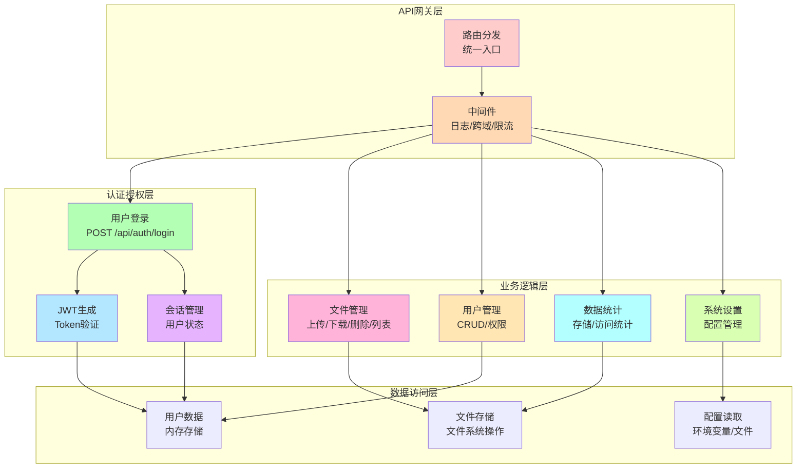

### 数据流架构图

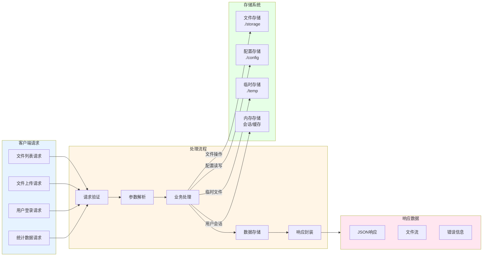

### 安全架构图

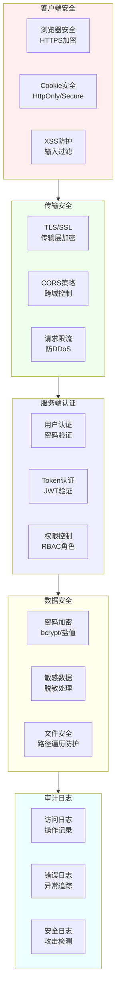

### 部署架构图

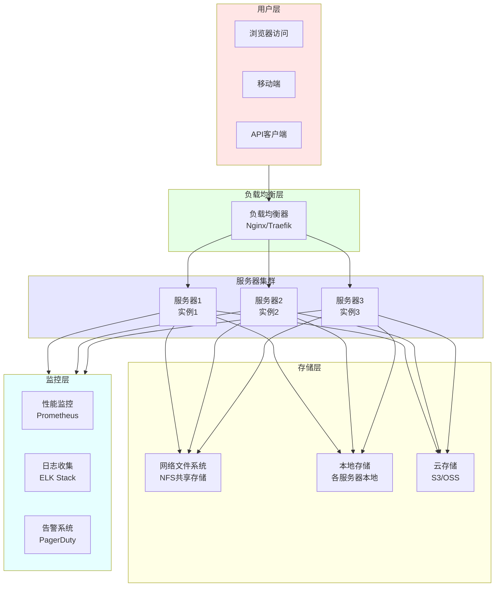

### 模块依赖关系图

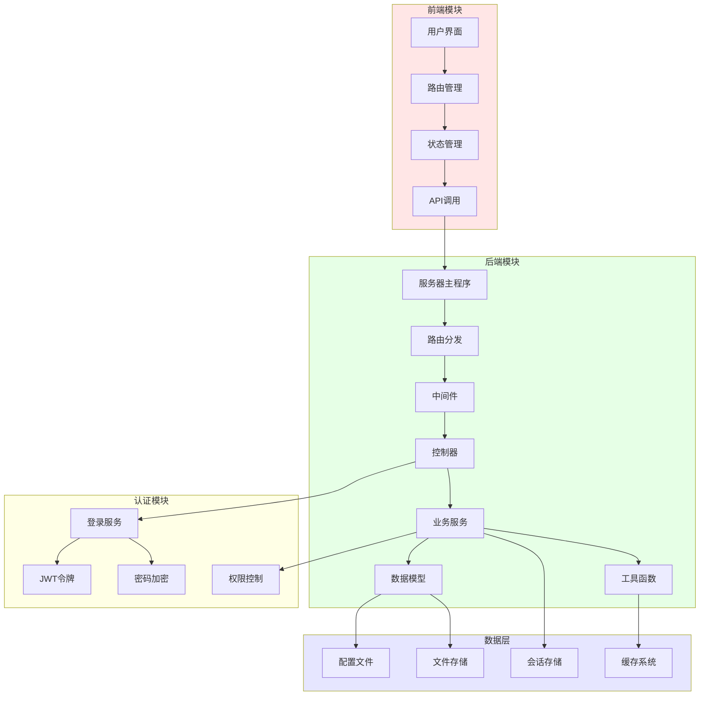

### 文件操作流程图

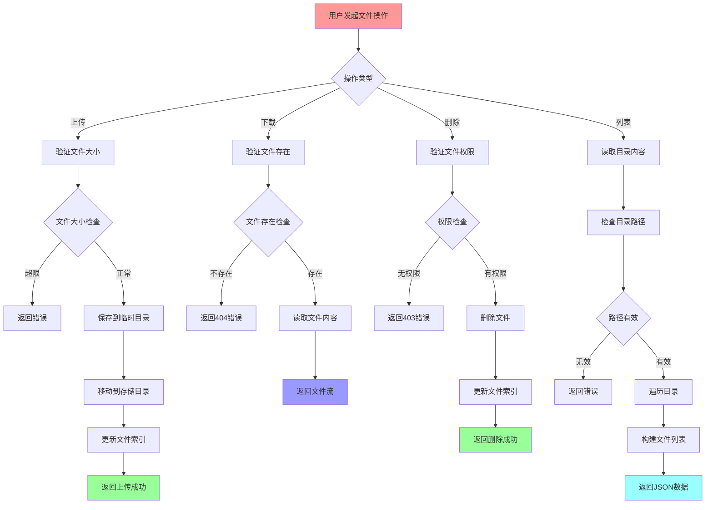

### 完整API交互序列图

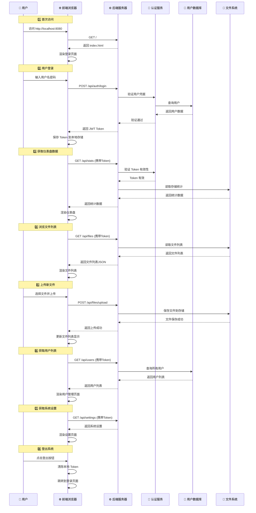

### 网络请求流程图

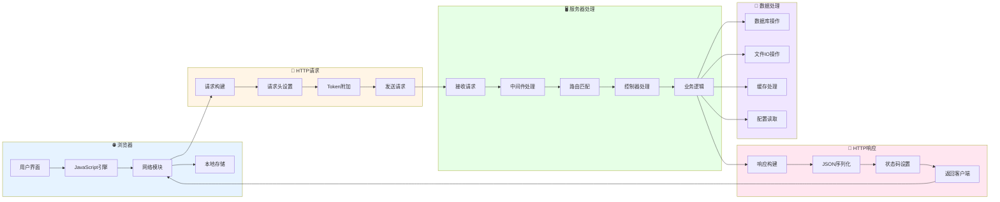

### 用户认证流程图

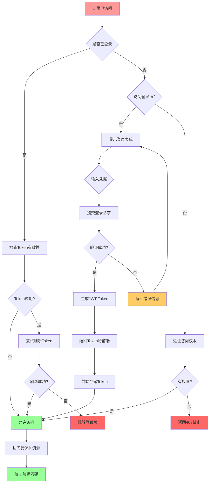

### 多语言版本技术对比图

```mermaid
graph TD
    subgraph Python[🐍 Python]
        P1[Flask框架]
        P2[JWT认证]
        P3[bcrypt加密]
        P4[自动安装依赖]
        P5[跨平台支持]
    end
    
    subgraph NodeJS[🟢 Node.js]
        N1[Express框架]
        N2[异步非阻塞]
        N3[npm生态]
        N4[高并发支持]
        N5[实时应用]
    end
    
    subgraph Java[☕ Java]
        J1[HttpServer]
        J2[无额外依赖]
        J3[强类型]
        J4[企业级]
        J5[JDK 11+]
    end
    
    subgraph PHP[🐘 PHP]
        PH1[内置服务器]
        PH2[广泛兼容]
        PH3[易于部署]
        PH4[共享主机]
        PH5[PHP 7.4+]
    end
    
    subgraph C[C语言]
        C1[Socket API]
        C2[高性能]
        C3[最小占用]
        C4[编译运行]
        C5[跨平台编译]
    end
    
    subgraph Shell[🐚 Shell]
        SH1[Bash脚本]
        SH2[Python HTTP]
        SH3[轻量级]
        SH4[Linux专用]
        SH5[快速启动]
    end
    
    subgraph Go[🔵 Go语言] 🆕
        G1[Gorilla Mux]
        G2[并发模型]
        G3[单二进制文件]
        G4[高性能]
        G5[跨平台编译]
    end
    
    subgraph Rust[🦀 Rust] 🆕
        R1[Actix-web]
        R2[内存安全]
        R3[零成本抽象]
        R4[极致性能]
        R5[无GC]
    end
    
    subgraph Ruby[💎 Ruby] 🆕
        RB1[Sinatra框架]
        RB2[优雅语法]
        RB3[Ruby生态]
        RB4[元编程能力]
        RB5[快速开发]
    end
    
    subgraph Kotlin[🟣 Kotlin] 🆕
        K1[Ktor框架]
        K2[协程支持]
        K3[JVM互操作]
        K4[空安全类型]
        K5[现代语法]
    end
    
    subgraph Swift[🍎 Swift] 🆕
        S1[Vapor 4框架]
        S2[Apple生态]
        S3[协议导向]
        S4[内存管理]
        S5[iOS/macOS集成]
    end
    
    style Python fill:#ffcccc
    style NodeJS fill:#ccffcc
    style Java fill:#ccccff
    style PHP fill:#ffccff
    style C fill:#ffffcc
    style Shell fill:#ccffff
    style Go fill:#cce6ff
    style Rust fill:#ffd9b3
    style Ruby fill:#e6ccff
    style Kotlin fill:#ffe6f0
    style Swift fill:#d9ffb3
```

## 🚀 快速开始

### 选择您的语言版本

本项目提供 **11种** 语言实现：

#### 🐍 解释型语言 (无需编译)

1. **Python版本** - 易于部署，生态丰富
   - 路径: [01_python_version](01_python_version/)
   - 框架: Flask
   - 启动: 双击 `scripts\启动.bat`

2. **Node.js版本** - 异步高性能
   - 路径: [02_nodejs_version](02_nodejs_version/)
   - 框架: Express
   - 启动: 双击 `scripts\启动.bat`

3. **PHP版本** - 广泛兼容
   - 路径: [04_php_version](04_php_version/)
   - 框架: 内置服务器
   - 启动: 双击 `scripts\启动.bat`

4. **Ruby版本** - 优雅简洁
   - 路径: [09_ruby_version](09_ruby_version/)
   - 框架: Sinatra
   - 启动: 双击 `scripts\启动.bat`

5. **Shell版本** - Linux/Unix专用
   - 路径: [06_shell_version](06_shell_version/)
   - 框架: Python HTTP + Bash
   - 启动: 运行 `scripts/启动.sh`

#### ⚙️ 编译型语言 (需要编译)

6. **Java版本** - 企业级可靠性
   - 路径: [03_java_version](03_java_version/)
   - 框架: JDK内置HttpServer
   - 启动: 双击 `scripts\启动.bat`

7. **Go语言版本** - 高并发性能
   - 路径: [07_go_version](07_go_version/)
   - 框架: Gorilla Mux
   - 启动: 双击 `scripts\启动.bat`

8. **Rust语言版本** - 内存安全+极致性能
   - 路径: [08_rust_version](08_rust_version/)
   - 框架: Actix-web
   - 启动: 双击 `scripts\启动.bat` (首次编译较慢)

9. **C语言版本** - 极致性能
   - 路径: [05_c_version](05_c_version/)
   - 框架: 原生Socket API
   - 编译: 双击 `scripts\编译.bat`
   - 启动: 双击 `scripts\启动.bat`

10. **Kotlin版本** - 现代化JVM语言
    - 路径: [10_kotlin_version](10_kotlin_version/)
    - 框架: Ktor
    - 启动: 双击 `scripts\启动.bat`

11. **Swift语言版本** - Apple生态系统
    - 路径: [11_swift_version](11_swift_version/)
    - 框架: Vapor 4
    - 启动: 运行 `scripts/启动.sh` (需要macOS或Linux)

## 📁 项目结构

```
小思超级NAS/
├── 01_python_version/          # Python版本 (Flask)
│   ├── src/                    # 源代码
│   ├── config/                 # 配置文件
│   └── scripts/                # 启动脚本
├── 02_nodejs_version/          # Node.js版本 (Express)
│   ├── src/
│   ├── config/
│   └── scripts/
├── 03_java_version/            # Java版本 (HttpServer)
│   ├── src/
│   ├── config/
│   └── scripts/
├── 04_php_version/            # PHP版本 (内置服务器)
│   ├── src/
│   ├── config/
│   └── scripts/
├── 05_c_version/               # C语言版本 (Socket API)
│   ├── src/
│   ├── config/
│   └── scripts/
├── 06_shell_version/          # Shell版本 (Python HTTP)
│   ├── src/
│   ├── config/
│   └── scripts/
├── 07_go_version/              # Go语言版本 (Gorilla Mux) 🆕
│   ├── src/
│   ├── config/
│   └── scripts/
├── 08_rust_version/            # Rust语言版本 (Actix-web) 🆕
│   ├── src/
│   ├── config/
│   └── scripts/
├── 09_ruby_version/            # Ruby版本 (Sinatra) 🆕
│   ├── src/
│   ├── config/
│   └── scripts/
├── 10_kotlin_version/          # Kotlin版本 (Ktor) 🆕
│   ├── src/
│   ├── config/
│   └── scripts/
├── 11_swift_version/           # Swift版本 (Vapor) 🆕
│   ├── src/
│   ├── config/
│   └── scripts/
└── public/                     # 公共前端文件 (所有版本共享)
    ├── index.html
    ├── styles.css
    └── app.js
```

## 🌟 主要功能

- **文件管理**: 上传、下载、创建文件夹
- **用户管理**: 用户注册、权限控制
- **存储统计**: 实时存储使用情况
- **系统设置**: 灵活的配置选项
- **跨平台**: 支持Windows、Linux、macOS

## 🔐 默认登录

- 用户名: `admin`
- 密码: `admin123`

## 📡 访问地址

启动后访问：
- 本地访问: `http://localhost:8080`
- 局域网访问: `http://<您的IP地址>:8080`

## 🛠️ 技术栈

### Python版本
- Flask
- Flask-CORS
- JWT认证
- bcrypt密码加密

### Node.js版本
- Express
- CORS
- JSON Web Token
- bcryptjs

### Java版本
- JDK内置HttpServer
- 无需额外依赖

### PHP版本
- PHP内置服务器
- JSON处理

### C语言版本
- POSIX Socket API
- Windows Winsock2
- 多线程支持

### Shell版本
- Python HTTP服务器
- Bash脚本

### Go语言版本 🆕
- Gorilla Mux (路由)
- dgrijalva/jwt-go (JWT认证)
- golang.org/x/crypto (bcrypt加密)

### Rust语言版本 🆕
- Actix-web 4 (高性能Web框架)
- jsonwebtoken (JWT认证)
- bcrypt (密码加密)
- serde (序列化/反序列化)

### Ruby版本 🆕
- Sinatra 3.0 (轻量级Web框架)
- jwt gem (JWT认证)
- bcrypt gem (密码加密)

### Kotlin版本 🆕
- Ktor (异步Web框架)
- jjwt (JWT认证)
- kotlinx.serialization (JSON处理)

### Swift版本 🆕
- Vapor 4 (服务器端Swift框架)
- Vapor JWT插件 (JWT认证)
- Fluent ORM (数据库操作)

## 📝 详细文档

- [多语言版本指南](多语言版本指南.md) - 各版本详细说明和对比

## 🤝 贡献

欢迎提交Issue和Pull Request！

## 📄 许可证

MIT License

## 👨‍💻 作者

小思AI团队

## 🙏 致谢

感谢所有开源项目的贡献者！
